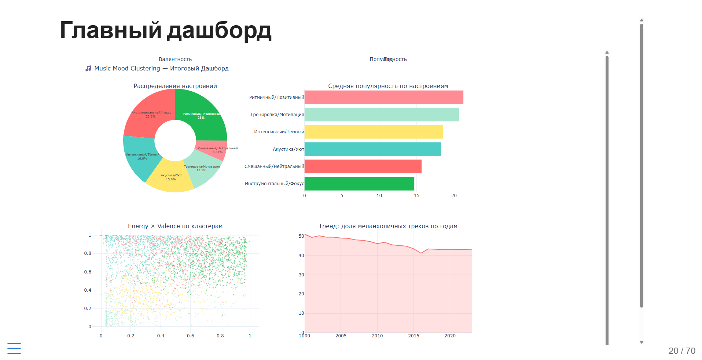
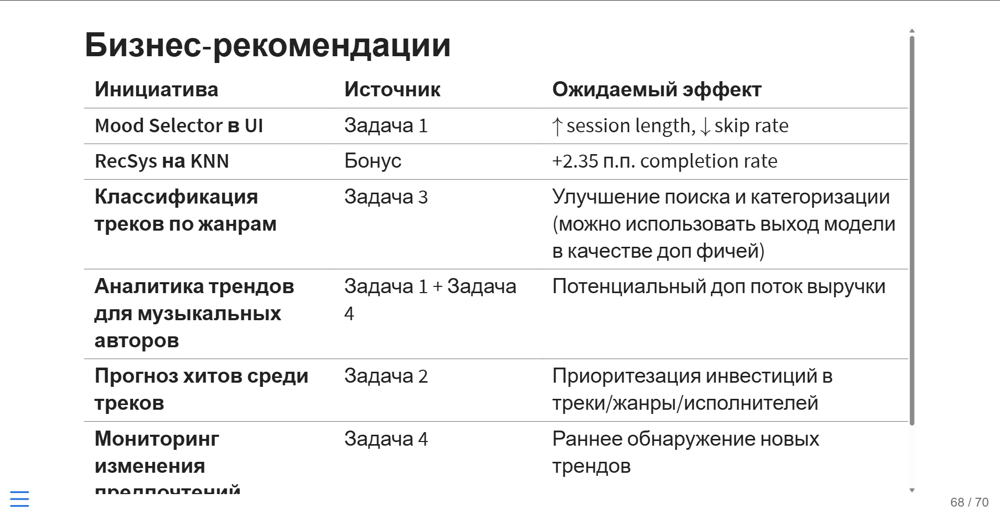

# School of Analytics 2025-2026 Hackathon

### Запуск (требуется только `uv`)

```bash
git clone https://github.com/alexveider1/soa_hackathon.git

cd soa_hackathon

uv sync
uv run jupyterlab
# запустить ноутбуки по отдельности
```

### Демонстрация




### Структура репозитория

| Путь | Назначение |
|---|---|
| `data/` | Исходные данные |
| `task_1/` | Задача 1 |
| `task_2/` | Задача 2 |
| `task_3/` | Задача 3 |
| `task_4/` | Задача 4 |
| `pyproject.toml`, `uv.lock`, `.python-version` | Конфигурация окружения |
| `presentation_temp.pptx` | промежуточная версия презентации |
| `presentation.qmd` и `presentation.html` | финальная версия презентации |

`Важно`: для просмотра презентации не требуется запуск ноутбуков и подключение к ядру, но необходимо наличие других папок из репозитория в окружении (для отображения графиков, в том числе динамических)

### Лицензия

[](https://opensource.org/licenses/MIT)
