# Введение

## Датасет

| Параметр | Значение |
|----|----|
| Объём | **1 159 764** трека |
| Уникальных артистов | 64 158 |
| Уникальных жанров | **82** |
| Временной охват | 2000 - 2023 гг. |
| Признаков | 13 числовых аудио-характеристик и 2 категориальные фичи |

**Аудио-признаки**: `danceability`, `energy`, `key`, `loudness`, `mode`, `speechiness`, `acousticness`, `instrumentalness`, `liveness`, `valence`, `tempo`, `duration_ms`, `time_signature`.

**Категориальные-признаки**: `artist_name`, `genre`

## Технологический стек

| Слой | Инструменты |
|----|----|
| Язык | **Python 3.12** |
| Управление зависимостями | **uv** |
| Классические ML | `scikit-learn`, `XGBoost`, `CatBoost`, `LightGBM` |
| Временные ряды | `statsmodels` (Holt, SARIMAX) |
| Кластеризация | `MiniBatchKMeans`, `UMAP` |
| Объяснимость | `SHAP` |
| Визуализация | `matplotlib`, `seaborn`, `plotly` |
| Ускорение | CUDA GPU для CatBoost и LightGBM |

## План презентации

1.  **Задача 1.** Кластеризация треков по настроению
2.  **Задача 2.** Предсказание популярности треков
3.  **Задача 3.** Многоклассовая классификация жанров
4.  **Задача 4.** Прогнозирование трендов аудио-характеристик и популярности жанров
5.  **Бонус.** Контентная рекомендательная система на KNN

В конце сводные выводы и рекомендации.

# Задача 1. Кластеризация по настроению

## Постановка задачи

**Гипотеза:** пользователи воспринимают музыку не столько по жанрам, сколько по эмоциональному профилю.

**Цель:** обнаружить типы треков по настроению пользователей во время прослушивания через кластеризацию аудио-характеристик

**Почему это важно:**

- Жанровые рекомендации часто промахиваются по настроению пользователя и контексту, в котором он находится
- Кластеризация по настроению даёт дополнительные признаки для рекомендательной системы $-$ можно улучшить ее
- Можно генерировать хорошие контекстуальные плейлисты

## Подготовка данных

**Выбор признаков** - 9 из 13 аудио-характеристик:

`danceability`, `energy`, `loudness`, `speechiness`, `acousticness`, `instrumentalness`, `liveness`, `valence`, `tempo`.

**Исключены:** `key`, `mode`, `time_signature` - они относятся к теории музыки, а не к эмоциональному восприятию.

**Препроцессинг:**

- Стандартизация через `StandardScaler`
- Итог: **1 136 690 треков с 9 признаками**

## EDA: распределения признаков

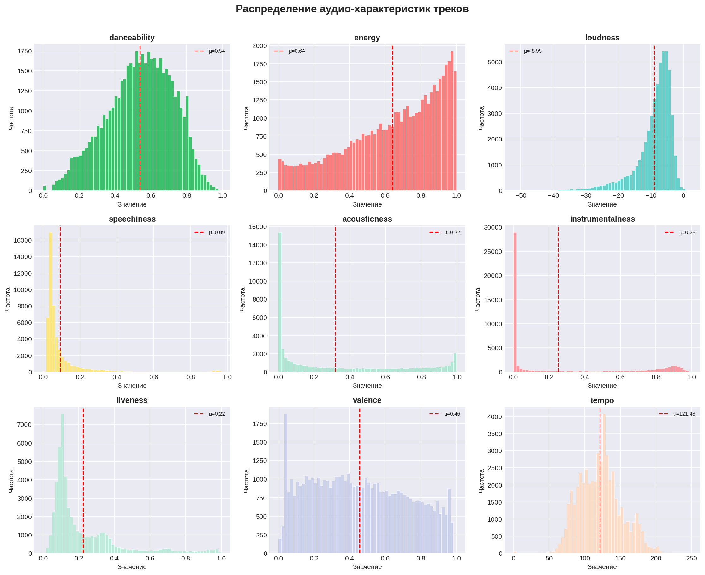{fig-align="center"}

9 гистограмм показывают, что распределения сильно различаются: `acousticness` и `instrumentalness` бимодальны с тяжелыми хвостами по краям распределений, `valence` и `danceability` ближе к нормальному. `speechless`, `loadness` и `liveness` асиметричны

## EDA: корреляции

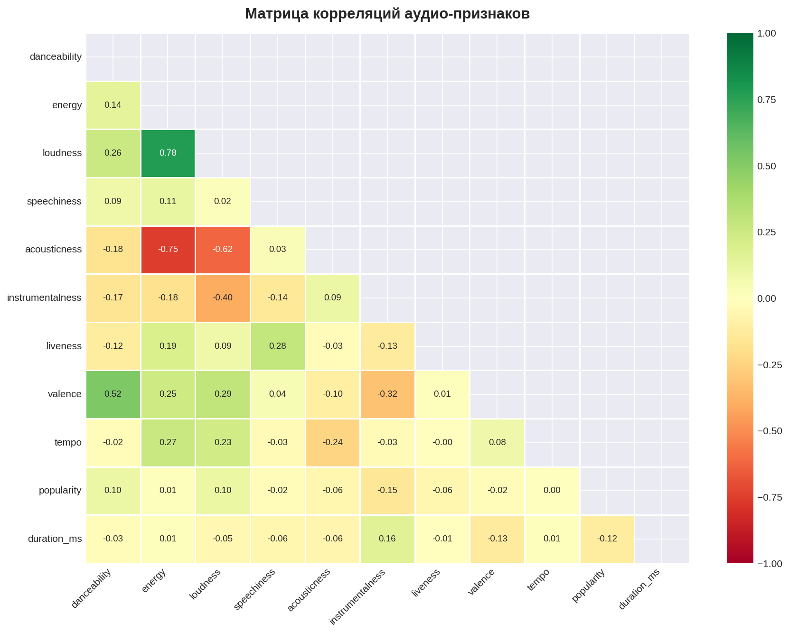{fig-align="center" width="85%"}

**Ключевые наблюдения:**

- `energy` и `loudness` сильно скоррелированы (0.78) - оба отражают громкость и плотность
- `acousticness` отрицательно коррелирует с `energy` (-0.7) - ожидаемо
- `valence` слабо связан со всеми остальными признаками

## Временная эволюция

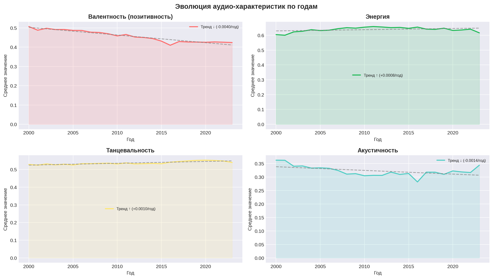{fig-align="center"}

**Наблюдения:**

- `valence` снижается с примерно 0.50 до чуть больше 0.4 за 23 года выборки $\Rightarrow$ музыка становится грустнее
- `energy` стабилен
- `acousticness` постепенно растёт
- `danceability` тоже постепенно растет

## Жанры и аудио-характеристики

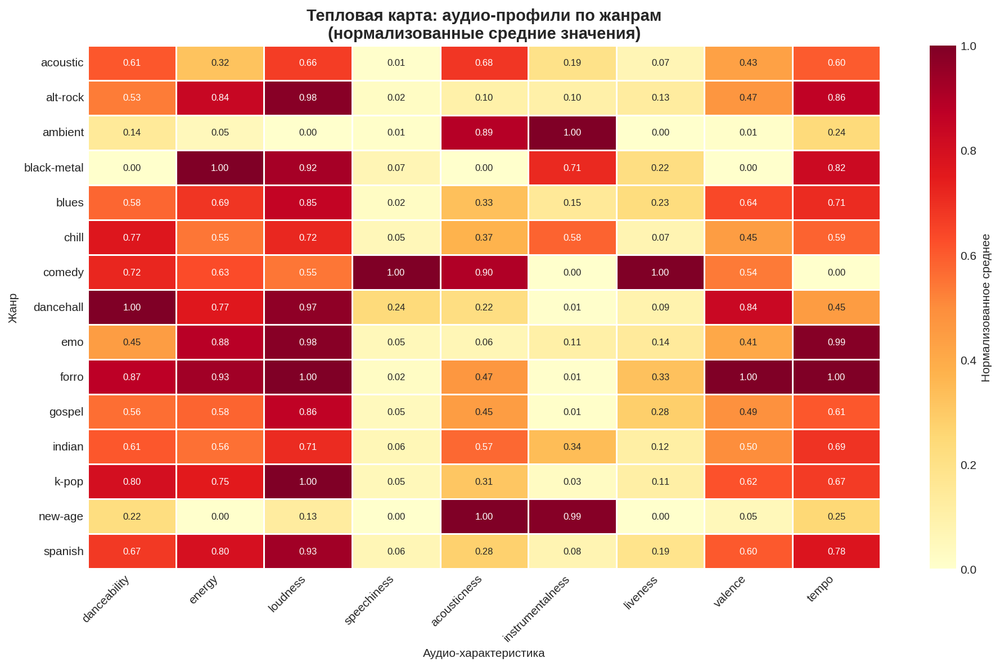{fig-align="center" width="85%"}

Тепловая карта по топ-15 жанрам и 9 признакам - видно, что наиболее популярные жанры сильно похожи по аудио-профилю

## Пространство Energy и Valence

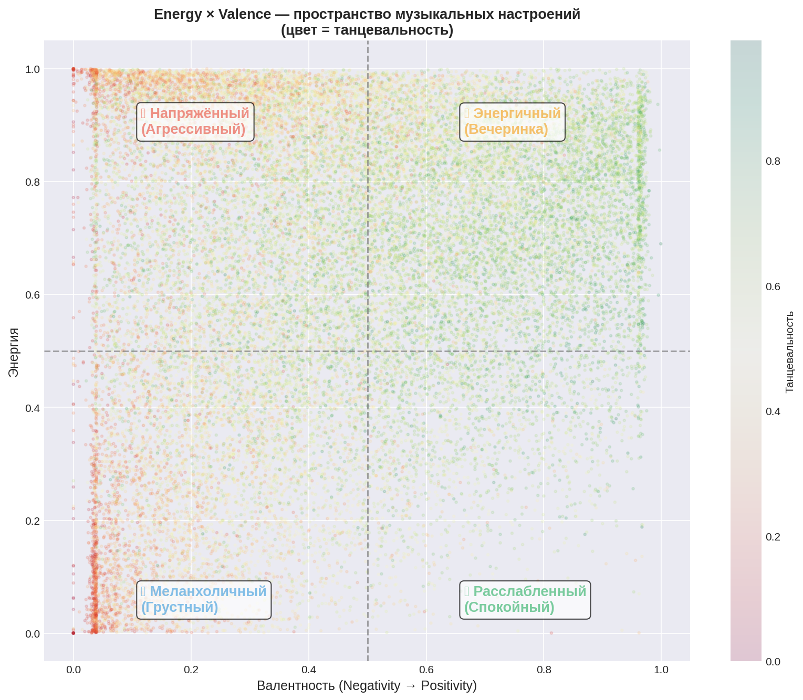{fig-align="center" width="80%"}

Четыре эмоциональных квадранта на проекции 30 000 треков (цвет = `danceability`):

| Квадрант       | Энергия | Валентность | Настроение          |
|----------------|---------|-------------|---------------------|
| верхний правый | высокая | высокая     | **Party / Энергия** |
| нижний правый  | низкая  | высокая     | **Calm / Relax**    |
| верхний левый  | высокая | низкая      | **Intense / Dark**  |
| нижний левый   | низкая  | низкая      | **Melancholy**      |

## Выбор оптимального K

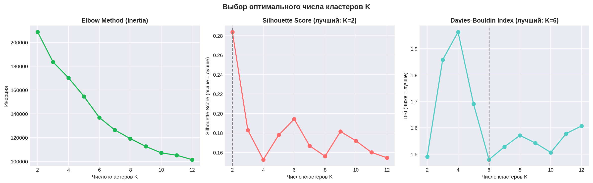{fig-align="center"}

Три согласованных метрики на выборке 30 000:

| Метрика              | Оптимум           | Значение         |
|----------------------|-------------------|------------------|
| Silhouette Score     | K = 6             | **0.1943**       |
| Davies-Bouldin Index | K = 6             | **1.4794**       |
| Метод локтя          | K $\approx$ 6 - 8 | излом на графике |

**Финальный выбор: K = 7** - компромисс между статистическим оптимумом и интерпретируемостью для бизнеса

## Алгоритм: MiniBatchKMeans

| Гиперпараметр | Значение |
|---------------|----------|
| `n_clusters`  | 7        |
| `n_init`      | 15       |
| `batch_size`  | 8 192    |
| `max_iter`    | 300      |

**Почему MiniBatch:** 1.1 млн объектов - классический K-Means слишком медленный, мини-батч даёт сильно быстрее, и при этом качество не сильно падает из-за репрезентативности мини-батча

## 7 кластеров настроений

| \#  | Архетип                    | Треков      | Доля       | Energy | Valence  |
|-----|----------------------------|-------------|------------|--------|----------|
| 0   | Интенсивный / Тёмный       | 189 235     | 16.6 %     | 0.85   | 0.27     |
| 1   | Тренировка / Мотивация     | 141 739     | 12.5 %     | 0.77   | 0.54     |
| 2   | Акустика / Уют             | 179 494     | 15.8 %     | 0.36   | 0.39     |
| 3   | Смешанный / Нейтральный    | 74 308      | 6.5 %      | 0.72   | 0.48     |
| 4   | **Ритмичный / Позитивный** | **284 568** | **25.0 %** | 0.73   | **0.71** |
| 5   | Инструментальный / Фокус   | 157 891     | 13.9 %     | 0.73   | 0.42     |
| 6   | Ambient / Lo-Fi            | 109 455     | 9.6 %      | 0.17   | 0.20     |

Самый крупный кластер - **Ритмичный / Позитивный** (четверть всего каталога).

## Профили кластеров

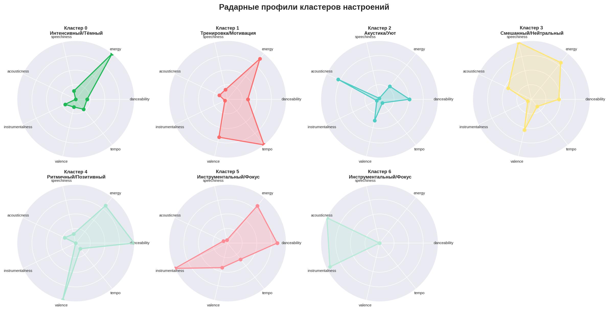{fig-align="center"}

## Жанры и Настроения

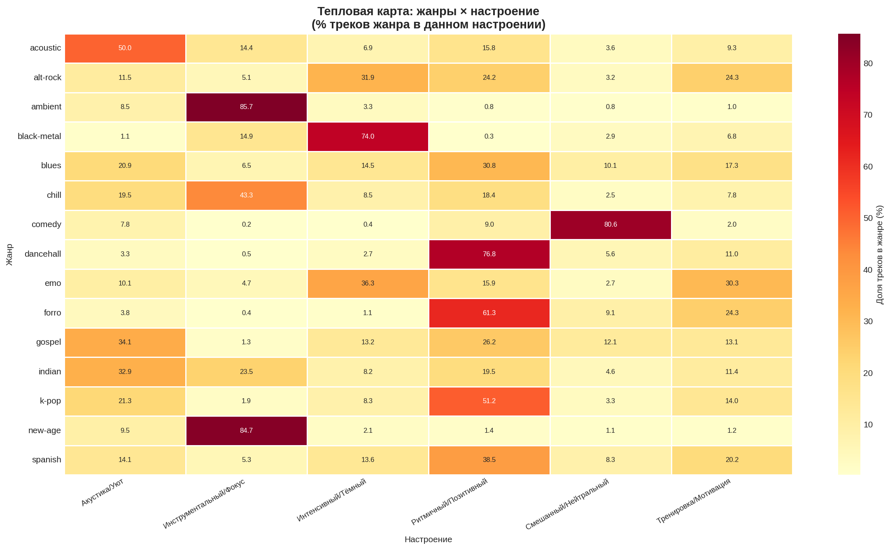{fig-align="center" width="85%"}

**Вывод:** один жанр распределяется по **4-5 кластерам** настроения. Например, *pop* живёт почти везде, *rock* концентрируется в `Dark/Intense`, электроника - в `Instrumental/Focus`.

Таким образом, жанр **не** является хорошим прокси настроения.

## Популярность по настроению

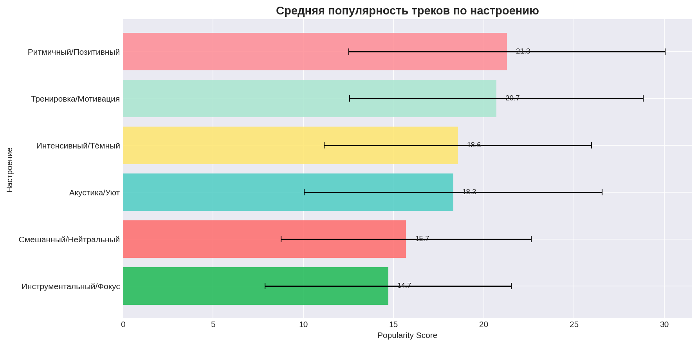{fig-align="center"}

## Главный дашборд

<iframe src="task_1/results/00_MAIN_DASHBOARD.html" width="100%" height="1000" style="border:0; background:white;">

</iframe>

## UMAP

<iframe src="task_1/results/08_mood_explorer_interactive_1.html" width="100%" height="1000" style="border:0; background:white;">

</iframe>

## Эволюция по годам

<iframe src="task_1/results/10_mood_evolution_decades.html" width="100%" height="1000" style="border:0; background:white;">

</iframe>

## Тренд по годам

<iframe src="task_1/results/11_mood_trend_by_year.html" width="100%" height="1000" style="border:0; background:white;">

</iframe>

## Выводы по задаче 1

- **Семь устойчивых архетипов настроения** покрывают весь каталог Spotify
- **Жанр** $\neq$ Настроение: один жанр распадается на 4-5 настроений
- **Музыка становится темнее и грустнее**: `valence` падает с 0.50 до 0.43
- **Ритмичный / Позитивный - главный коммерческий кластер** (25 % каталога, наибольшая средняя популярность)
- **Бизнес-применения:** mood-radio, слайдер настроения в UI, контекстуальные плейлисты (утренняя спокойная музыка, монотонная музыка для учебы, для занятий спортом и т д)

# Задача 2. Предсказание популярности треков

## Постановка задачи

**Цель:** предсказать `popularity` трека (0 - 100) и классифицировать его как **хит** (`popularity >= 70`) на основе аудио-характеристик и метаданных.

**Главная проблема:** сильный **дисбаланс классов** - хитов всего $\approx$ 0.3 % от всех треков.

| Параметр          | Значение             |
|-------------------|----------------------|
| Объём тренировки  | 811 234              |
| Объём теста       | 348 530              |
| True hits в тесте | $\approx$ 1 039      |
| Доля хитов        | 0.3 %                |
| Целевой порог     | popularity $\geq$ 70 |

## Архитектура

Класс [`HitPrediction`](task_2/models.py) - единый интерфейс над разными имплементациями ML моделей

<!-- сгенерировали эту диаграму -->

```         
        ┌──────────────────────────────┐
   X -> │   HitPrediction              │  -> predict_popularity (log-prob)
        │  ─────────────────────────   │  -> predict_hit (0/1)
        │  • деление cat/num           │  -> evaluate (F1, ROC-AUC, CM)
        │  • LabelEncoder для sklearn  │
        │  • native cat features в CB  │
        │  • MODEL_FACTORY: 3 модели   │
        └──────────────────────────────┘
                       │
            ┌──────────┼──────────┐
            ▼          ▼          ▼
         CatBoost   XGBoost   LinearRegression
```

Конфиги моделей вынесены в [`task_2/mappings.py`](task_2/mappings.py).

## Конфигурации моделей

**CatBoost**:

``` python
iterations=1000, depth=8, learning_rate=0.03,
loss_function="RMSE", eval_metric="RMSE",
early_stopping_rounds=50
```

**XGBoost**:

``` python
n_estimators=300, max_depth=6, learning_rate=0.05,
objective="reg:squarederror", n_jobs=-1
```

**LinearRegression** - бейзлайн

Бинаризация: `predict_hit = (predict_popularity $\geq$ hit_border)`, по умолчанию `hit_border = 70`.

## Результаты сравнения моделей

| Модель           | F1 (hit)   | ROC-AUC    | Время обучения | TP     | FP     |
|------------------|------------|------------|----------------|--------|--------|
| LinearRegression | 0.0000     | 0.8251     | 1.2 c          | 0      | 0      |
| CatBoost         | 0.0038     | 0.9482     | 79.8 c         | 2      | 5      |
| **XGBoost**      | **0.0188** | **0.9513** | **13.8 c**     | **10** | **13** |

**XGBoost** выигрывает по ROC-AUC и F1 при пороге 70 и при этом существенно быстрее, чем `CatBoost` (при обучении и инференсе на CPU)

## Confusion matrix

|                    | Предсказано: не хит | Предсказано: хит |
|--------------------|---------------------|------------------|
| **Истина: не хит** | 346 878 (TN)        | 13 (FP)          |
| **Истина: хит**    | 1 029 (FN)          | 10 (TP)          |

**Precision** = 10 / 23 = **43.5 %** - почти половина предсказанных хитов действительно хиты.

**Recall** = 10 / 1 039 = **0.96 %** - но мы ловим меньше 1 % всех хитов.

## Выводы по задаче 2

- **XGBoost - рекомендованная имлементация градиентного бустинга**: ROC-AUC 0.9513, при этом обучение быстрое
- **F1 низкий не из-за плохой модели**, а из-за сильного дисбаланса классов; ROC-AUC как метрика более информативен на таких данных
- **Точки роста:**
  - Понижение `hit_border` до 50 - 60 для увеличения recall
  - `class_weight="balanced"` или SMOTE/undersampling
  - Добавление temporal-фичей (тренд популярности артиста), social features (упоминания)
  - Двухэтапная стратегия: regress popularity $\rightarrow$ калибровать порог под бизнес-цель

# Задача 3. Классификация жанров

## Постановка задачи

**Цель:** для каждого трека предсказать **один из 82 жанров** по 13 аудио-признакам.

**Особенности задачи:**

- **82 класса** - многоклассовая задача
- **Сильная несбалансированность** жанров
- Без текстовых / визуальных / social-фичей - только аудио

| Выборка | Размер  | Процент |
|---------|---------|---------|
| Train   | 811 834 | 70 %    |
| Val     | 173 965 | 15 %    |
| Test    | 173 965 | 15 %    |

Трейн-вал-тест сплит сделали через `StratifiedShuffleSplit`

## Архитектура стэкинг-ансамбля

<!-- сгенерировали эту диаграму -->

```         
   X (13 признаков)
       │
   ┌───┴─────────────────┐
   ▼                     ▼
 LightGBM            CatBoost
 (GPU, 300 итер)    (GPU, 400 итер)
   │                     │
   ▼                     ▼
 P_lgbm (82)        P_cb (82)
   └────────┬────────────┘
            ▼
   stacked (164 признака)
            │
            ▼
   Logistic Regression
   (C=1.0, lbfgs, balanced)
            │
            ▼
   meta_proba (82)
            │
            ▼
   + log-prior shift (per-class)
     [grid [-2, +2], 21 точка, 2 прохода,
      оптимизация macro-F1]
            │
            ▼
   final P (82) -> argmax
```

## Базовые модели

**LightGBM:**

``` python
objective="multiclass", num_class=82,
class_weight="balanced",
n_estimators=300, learning_rate=0.05,
num_leaves=255, min_data_in_leaf=20,
feature_fraction=0.9, bagging_fraction=0.9,
reg_lambda=1.0, device="gpu", seed=123
```

**CatBoost:**

``` python
iterations=400, depth=6, learning_rate=0.08,
l2_leaf_reg=4.0, bagging_temperature=0.5,
loss_function="MultiClass",
eval_metric="TotalF1:average=Macro",
auto_class_weights="Balanced",
task_type="GPU", random_seed=123,
early_stopping_rounds=60
```

## Логистическая регрессия и ее калибровка

``` python
LogisticRegression(C=1.0, solver="lbfgs",
                   max_iter=2000,
                   class_weight="balanced",
                   random_state=123)
```

Обучается на **валидации**, не на трейне, чтобы не переобучиться под неоткалиброванные вероятности от бустингов

- Для каждого из 82 классов ищем оптимальный сдвиг логита в диапазоне `[-2, +2]`
- **Метрика оптимизации - macro F1**
- Результат: после калибровки macro-F1 поднимается с 0.2575 до **0.2696** на валидации (+1.2 п.п.)

## Сравнение моделей

| Модель | Macro F1 | Weighted F1 | Top-1 Acc | Top-3 Acc | Top-5 Acc |
|------------|------------|------------|------------|------------|------------|
| Single CatBoost (baseline) | 0.2350 | 0.2558 | 0.2756 | 0.4702 | 0.5725 |
| Base: LightGBM | 0.2575 | 0.2803 | 0.2947 | 0.4904 | 0.5922 |
| Base: CatBoost (ensemble) | 0.2292 | 0.2497 | 0.2705 | 0.4629 | 0.5652 |
| Ensemble (Raw) | 0.2575 | 0.2789 | 0.2843 | 0.4663 | 0.5643 |
| **Ensemble (Calibrated)** | **0.2648** | **0.2872** | **0.2843** | 0.4654 | 0.5618 |

## Положительное влияние ансамбля на конкретные жанры

Топ-10 жанров с наибольшим приростом F1 (Ensemble - Single CB):

| Жанр       | Train count | Single F1 | Ensemble F1 | $\Delta$ F1 |
|------------|-------------|-----------|-------------|-------------|
| sad        | 4 260       | 0.231     | **0.341**   | **+0.110**  |
| hardstyle  | 8 694       | 0.588     | 0.691       | +0.103      |
| groove     | 9 356       | 0.074     | 0.158       | +0.084      |
| romance    | 4 563       | 0.342     | 0.424       | +0.082      |
| spanish    | 13 411      | 0.034     | 0.100       | +0.076      |
| party      | 6 684       | 0.302     | 0.376       | +0.075      |
| tango      | 10 548      | 0.578     | 0.653       | +0.074      |
| emo        | 14 591      | 0.111     | 0.185       | +0.074      |
| deep-house | 12 527      | 0.239     | 0.312       | +0.073      |
| sleep      | 12 496      | 0.588     | 0.654       | +0.067      |

## Отрицательное влияние ансамбля на конкретные жанры

| Жанр      | Train count | Single F1 | Ensemble F1 | $\Delta$ F1 |
|-----------|-------------|-----------|-------------|-------------|
| punk      | 4 338       | 0.088     | 0.063       | -0.025      |
| metalcore | 4 387       | 0.144     | 0.124       | -0.021      |
| rock      | 2 323       | 0.031     | 0.014       | -0.017      |
| power-pop | 12 013      | 0.251     | 0.235       | -0.016      |
| afrobeat  | 8 677       | 0.191     | 0.184       | -0.007      |

## Прирост F1 по жанрам vs размер выборки

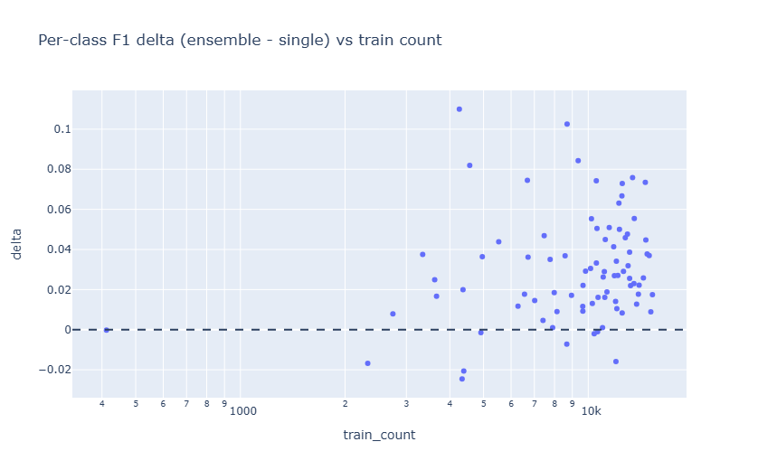{fig-align="center"}

## Confusion matrix: топ-30 жанров

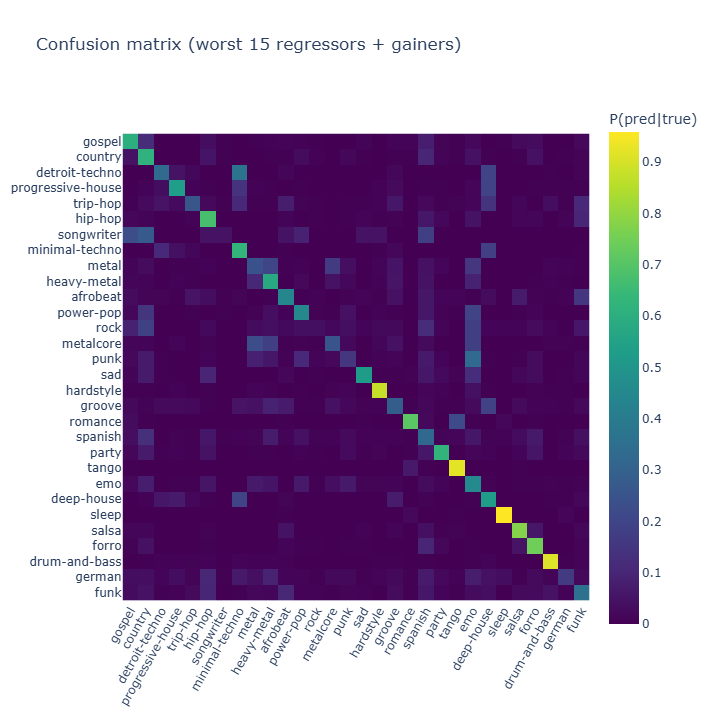{fig-align="center"}

## SHAP: важность признаков

SHAP считался на 1500 случайно просемплированных треках:

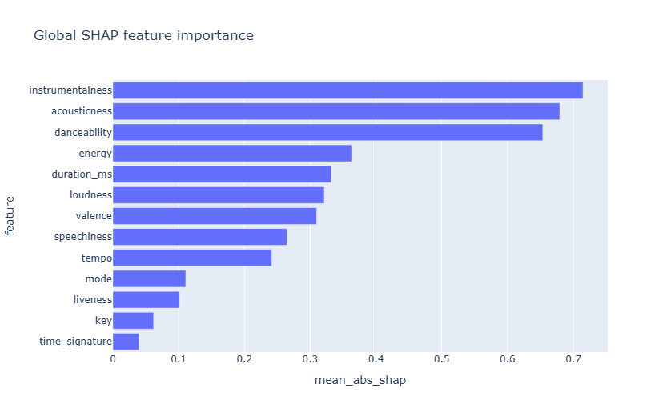{fig-align="center" width="80%"}

**Главные признаки жанра - наличие вокала, акустичность, танцевальность.** Темп и тональность почти не влияют на прогноз модели

## SHAP по выбранным жанрам

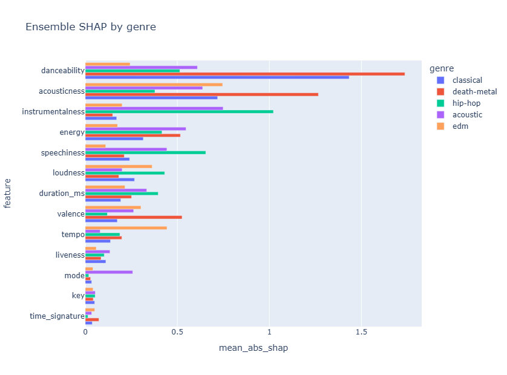{fig-align="center" width="85%"}

Разрез SHAP по 5 достаточно разным жанрам (classical, death-metal, hip-hop, acoustic, edm) показывает, что для каждого жанра доминируют **разные** признаки: `acousticness` ярко выделяет classical, `speechiness` - hip-hop, `instrumentalness` - acoustic.

## Веса в лог регрессии

| Вид бустинга | Доля влияния |
|--------------|--------------|
| **LightGBM** | **51.8 %**   |
| **CatBoost** | **48.2 %**   |

Бустинги вносят сопоставимый, но **различающийся по жанрам** вклад:

| Жанр    | Предпочитает LGBM | Жанр           | Предпочитает CatBoost |
|---------|-------------------|----------------|-----------------------|
| rock    | 57.8 %            | metalcore      | 51.7 %                |
| german  | 57.0 %            | sad            | 51.5 %                |
| edm     | 55.9 %            | sertanejo      | 51.1 %                |
| swedish | 55.5 %            | minimal-techno | 51.0 %                |
| k-pop   | 54.1 %            | club           | 50.4 %                |

$\Rightarrow$ Стэкинг действительно улучшает прогноз базовых моделей (именно этого эффекта мы и хотели добиться)

## Бизнес-эксперимент: популярность плейлистов

**Гипотеза:** ML-курированные плейлисты (treatment) популярнее жанрово-курированных (control).

**Сетап:**

- Eligible: 60 жанров с $\geq$ 200 тестовыми треками
- Control: 200 плейлистов по 50 треков (по истинным классам)
- Treatment: 180 плейлистов по 50 треков (по прогнозам)

| Метрика         | Control   | Treatment | $\Delta$ | p-value   |
|-----------------|-----------|-----------|----------|-----------|
| Mean popularity | **18.73** | 17.11     | -1.62    | **0.083** |

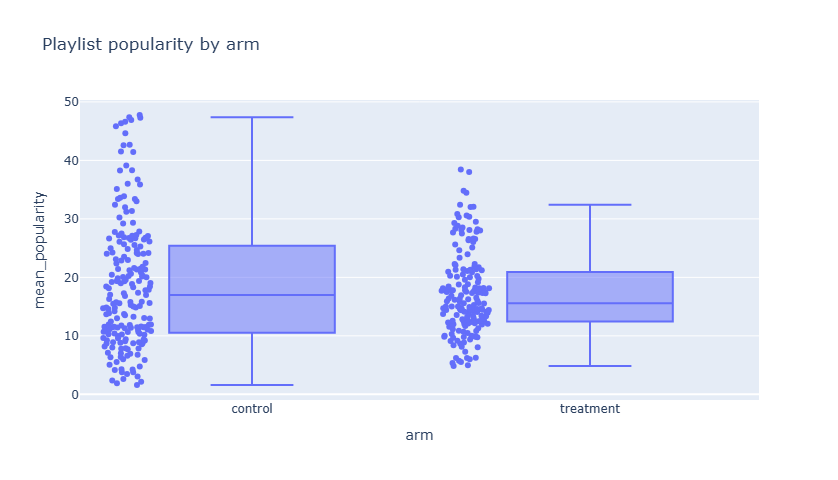{fig-align="center" width="70%"}

**Результат - статистически не значим** (p \> 0.05). Treatment плейлисты чуть менее популярны (но в пределах шума).

**Интерпретация:** средняя популярность как прокси метрика $-$ плохой выбор для оценки качества рекомендаций: она сильно зашумлёна и не отражает реальную пользу модели

## Бизнес-эксперимент: completion rate

**Гипотеза:** ML-рекомендации увеличивают долю **дослушанных** треков.

**Симуляция:**

$$logit = -0.4 + 0.9*match + 0.6*audio_sim + 0.25*pop_z + N(0, 0.1)
*completion = sigmoid(logit)$$

**Сетап:** 2 000 пользователей по 4 на 25 треков

| KPI                 | Control (true genre) | Treatment (ML) | $\Delta$            |
|---------------------|----------------------|----------------|---------------------|
| Completion rate     | 68.525 %             | **70.875 %**   | **+2.35 п.п.**      |
| z-statistic         | \-                   | \-             | 3.234               |
| **p-value**         | \-                   | \-             | **0.00122**         |
| 95 % CI (bootstrap) | \-                   | \-             | \[0.97, 3.76\] п.п. |

**Эффект статистически значим (p \< 0.005)**

## Выводы по задаче 3

- **Ансамбль LGBM + CatBoost + LogReg + калибровка** даёт **+2.98 п.п.** macro-F1 к одиночному CatBoost
- **Калибровка вероятностей** добавляет **+0.73 п.п.** macro-F1 после обучения
- Бизнес-эффект: **+2.35 п.п. completion rate** (p = 0.005) - продуктово значимо

# Задача 4. Прогнозирование трендов

## Постановка задачи

**Цель:** проанализировать долгосрочные тренды музыки и спрогнозировать их на **5 лет вперёд**.

Два направления:

1.  **Тренды аудио-характеристик** (`energy`, `danceability`, `valence`, `acousticness`)
2.  **Популярность жанров** (топ-8 жанров с непрерывной историей)

**Подход:**

- Агрегируем датасет по годам $\rightarrow$ берём **медианы** признаков (устойчиво к выбросам)
- Train: $\leq$ 2018
- Test: 2019 - 2023
- Сравниваем 3 модели на одной выборке

## Подход: три модели

| Модель | Что моделирует | Параметры |
|------------------|--------------------------------|----------------------|
| **Linear Regression** | базовый линейный тренд | OLS, без сезонности |
| **Exponential Smoothing** | уровень + тренд (Holt) | без сезонной компоненты |
| **SARIMAX (1, 1, 0)** | AR(1) с дифференцированием | p=1, d=1, q=0, без экзогенных |

**Метрики:** MAE и RMSE на тесте 2019 - 2023.

## Тренды аудио-признаков

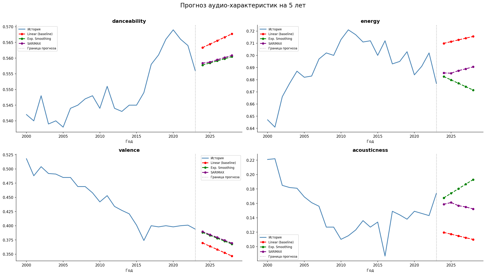{fig-align="center" width="90%"}

Четыре панели - `danceability`, `energy`, `valence`, `acousticness`. Тренды 2000 - 2023 + прогноз 2024 - 2028 от трёх моделей.

**Направления трендов:**

| Признак            | Тренд              | Интерпретация                 |
|--------------------|--------------------|-------------------------------|
| `energy`           | $\uparrow$         | музыка становится плотнее     |
| `danceability`     | $\uparrow$         | больше ритма                  |
| `loudness`         | $\uparrow$         | громче (loudness war)         |
| `tempo`            | $\uparrow$         | темп растёт                   |
| `acousticness`     | $\downarrow$       | живой звук теряет долю        |
| `instrumentalness` | $\downarrow$       | вокал доминирует              |
| `valence`          | $\approx$ стабилен | (с очень медленным снижением) |

## Топ-8 жанров: динамика популярности

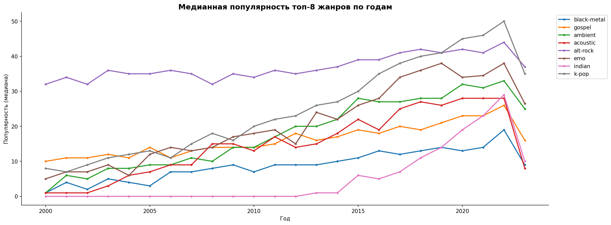{fig-align="center" width="85%"}

Анализируемые жанры: **black-metal, gospel, ambient, acoustic, alt-rock, emo, indian, k-pop**.

`k-pop` показывает **взрывной рост** в 2010-х; `emo` и `alt-rock` теряют долю; `gospel` и `acoustic` стабильны.

## Прогноз по жанрам

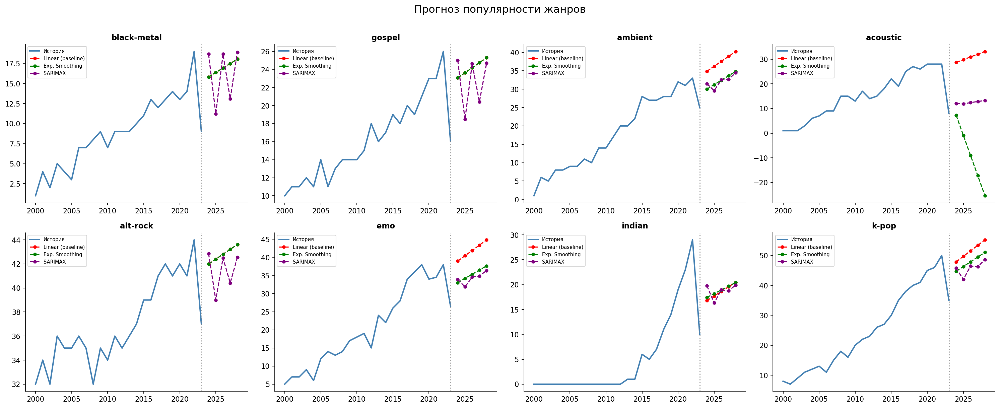{fig-align="center" width="90%"}

8 панелей (по одной на жанр), на каждой - три модели прогноза до 2028 года.

Прогнозы - **направляющие**, не абсолютные: `SARIMAX` и `ExpSmoothing` близки, `LinearRegression` сильно расходится на горизонте.

## Метрики прогноза

Усреднённый MAE по 4 ключевым аудио-признакам:

| Модель                    | Avg MAE    | Avg RMSE |
|---------------------------|------------|----------|
| LinearRegression          | 0.0343     | \-       |
| **Exponential Smoothing** | **0.0148** | \-       |
| **SARIMAX (1, 1, 0)**     | **0.0148** | \-       |

**Победители: Holt и SARIMAX** (дают практически одинаковую точность), обе модели в **2.3 раза точнее** простого линейного тренда.

Разбивка SARIMAX по признакам:

| Признак        | MAE    |
|----------------|--------|
| `danceability` | 0.0048 |
| `energy`       | 0.0139 |
| `acousticness` | 0.0196 |
| `valence`      | 0.0210 |

## Выводы по задаче 4

- **Музыка движется к более интенсивному, танцевальному, громкому звуку**; акустический и инструментальный сегменты сжимаются
- **Holt-Winters / SARIMAX(1,1,0) - оптимальные модели** для медианных временных рядов аудио-фичей
- Линейный тренд плох на горизонте \> 2 лет
- **Бизнес-применения:**
  - ожидать рост запросов на более энергичные треки, чаще добавлять их в курируемые подборки
  - 5-летние прогнозы - для лучшего планирования инвестиций в авторов в зависимости от жанров

# Бонусная задача. Рекомендательная система

## Постановка задачи

**Цель:** для произвольного затравочного трека находить **5 похожих** по аудио-характеристикам.

**Ограничения:**

- Только аудио - без коллаборативных рекомендаций
- Должно работать быстро + хорошо масштабироваться на большую музыкальную библиотеку

**Архитектура:** контентная система на **K-Nearest Neighbors**.

## Подход: KNN на 9 признаках

| Параметр      | Значение                          |
|---------------|-----------------------------------|
| Алгоритм      | `ball_tree` (sklearn)             |
| Метрика       | L2                                |
| Признаков     | 9 аудио фичей                     |
| K             | 20 кандидатов $\rightarrow$ top-5 |
| Препроцессинг | StandardScaler                    |

## Пайплайн рекомендации

<!-- сгенерировали эту диаграму -->

```         
   запрос (название/артист)
        │
        ▼
   найти seed track в индексе
        │
        ▼
   ball_tree -> 20 ближайших (без самого себя)
        │
        ▼
   similarity = (1 - dist / dist_max) * 100 %
        │
        ▼
   sort & take top-5
```

## Профиль рекомендаций

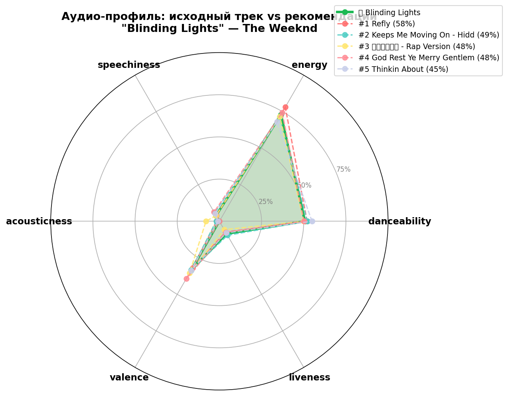{fig-align="center"}

## PCA

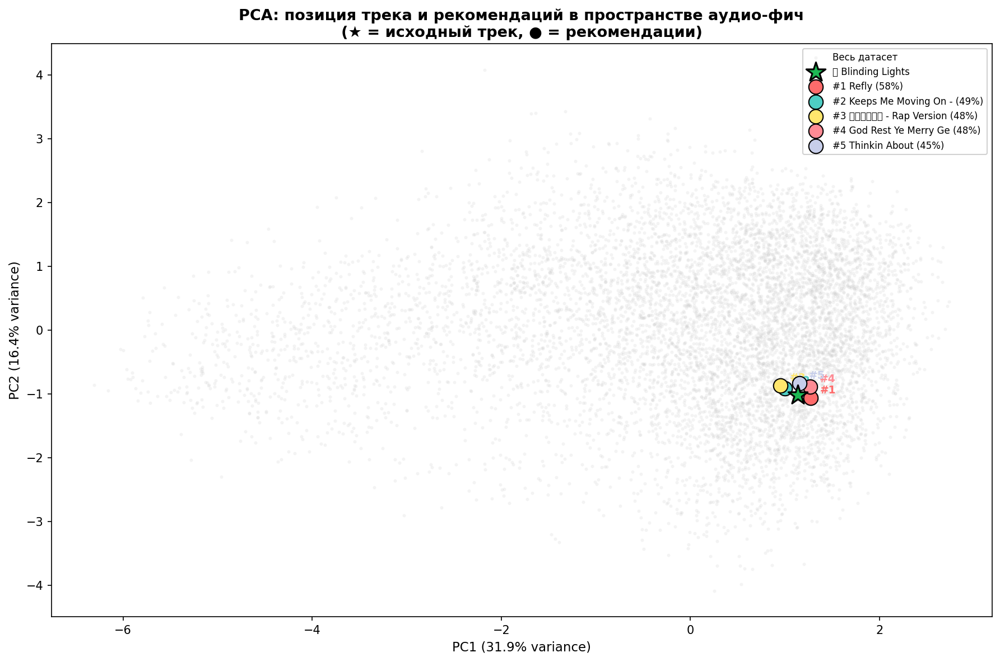{fig-align="center"}

**Вывод:** рекомендации лежат в **компактной окрестности** seed-трека.

## Демонстрация работы рекомендательной системы

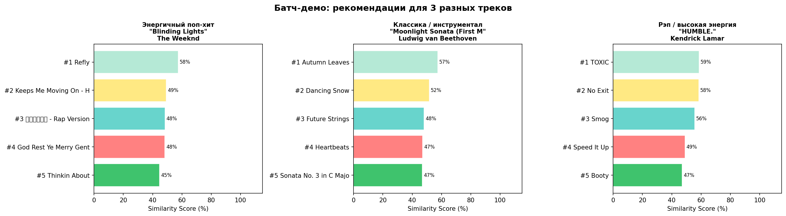{fig-align="center"}

## Оценка качества

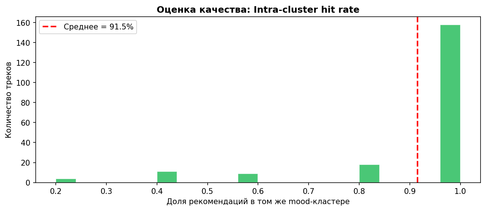{fig-align="center" width="80%"}

**Результат:** распределение сильно сдвинуто вправо $\Rightarrow$ большинство рекомендаций сохраняют настроение

## Similarity bars

<iframe src="task_bonus/result/rec_similarity_bars.html" width="100%" height="1000" style="border:0; background:white;">

</iframe>

## Выводы по бонусной задаче

- **Контентный подход выходит за рамки жанра** - рекомендует похожие **по звучанию** треки даже из других жанров
- **Качество подтверждено intra-cluster hit-rate**
- **Можно использовать кластеры из первой задачи**
- Можно масштабировать (**использование ANN**)

# Выводы

## Общие выводы по всем задачам

1.  **Настроение важнее жанра.**

2.  **Аудио-признаки доминируют.**

3.  **Музыкальные предпочтения изменяются во времени.**

4.  **Стэкинг и калибровка вероятностей хорошо подходит для многожанровой классификации**

## Бизнес-рекомендации

| Инициатива | Источник | Ожидаемый эффект |
|----------------------|------------------|--------------------------------|
| **Mood Selector в UI** | Задача 1 | $\uparrow$ session length, $\downarrow$ skip rate |
| **RecSys на KNN** | Бонус | +2.35 п.п. completion rate |
| **Классификация треков по жанрам** | Задача 3 | Улучшение поиска и категоризации (можно использовать выход модели в качестве доп фичей) |
| **Аналитика трендов для музыкальных авторов** | Задача 1 + Задача 4 | Потенциальный доп поток выручки |
| **Прогноз хитов среди треков** | Задача 2 | Приоритезация инвестиций в треки/жанры/исполнителей |
| **Мониторинг изменения предпочтений пользователей со временем** | Задача 4 | Раннее обнаружение новых трендов |

## Использование ИИ в проекте

- Визуальное оформление презентации, графиков
- Поиск ошибок в коде, помощь с дебагом

## Благодарности

::: {style="text-align: center; font-size: 2em; font-weight: bold;"}
<br><br> Спасибо за внимание!
:::